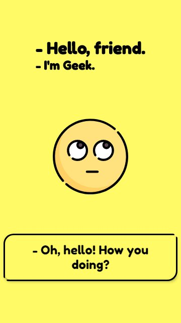
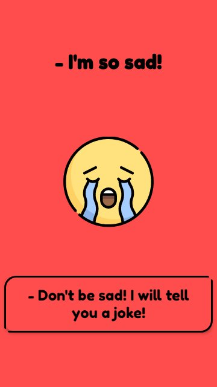
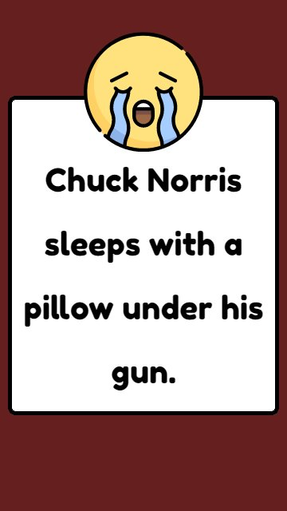
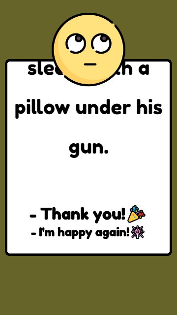
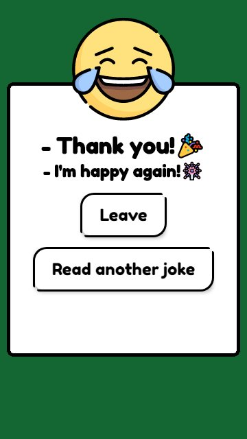

# Sad But Happy Geek

## [Live Demo](https://gabrielsancho.dev/sad_but_happy_geek/)

## Tecnologias utilizadas
- [x] Componentes **Vue.js**
  - [x] **Class components** e **Typescript**
- [x] Gereneciamento de estados com **Vuex**
- [x] Testes utilizando **jest** e os **test-utils** do Vue.js

## Detalhes da solução
#### O projeto contém três páginas com suas respectivas rotas:
  - **Home**: Onde a SPA começa no estado triste.
  - **HelpTheGeek**: Onde a SPA vai para o estado neutro.
  - **Happiness**: Onde a felicidade da SPA vai aumentado de acordo com a leitura da piada.

#### Contém dois componentes auxiliares:
  - **Geek**: Que está presente em todas as páginas sem ser recarregado, reagindo aos estados de felicidade.
  - **Modal**: Aparece assim que entra na rota **/happiness** e só pode ser fechado quando for feito a leitura completa da piada (movimento de scroll da página) e a SPA esteja feliz!

#### Nos testes são verificados: 
  - O carregamento correto dos componentes de suas respectivas rotas.
  - Verifica se o componente `Geek` responde as mudanças de estados de felicidade da SPA.
  - Verifica se componente `Modal` tem o seu comportamento correto, ou seja, se ele abre corretamente e se so pode ser fechado quando for feito a leitura completa da pidada.
  
> #### Não foi utilizado nenhuma framework CSS, tendo em vista a maior peformance da aplicação, uma vez que os layouts são bastante simples não necessitando a utilização de tais.

# Capturas de tela

| Humor neutro                         | Triste                                      |
| ------------------------------------ | ------------------------------------------- |
|  |  |

| Começo da piada, triste                      | Metade da piada, neutro                      | Final da piada, feliz                        |
| -------------------------------------------- | -------------------------------------------- | -------------------------------------------- |
|  |  |  |

# Configuração de projeto

## Instala as dependências do projeto
```
yarn install
```

### Compila e ativa o hot-reload para desenvolvimento
```
yarn serve
```

### Compila e minifica para produção
```
yarn build
```

### Roda os testes
```
yarn test:unit
```

### Lints e corrige arquivos
```
yarn lint
```

----

# O desafio

# Tecnologias

O que deve conter:

* Componentes de interface gráfica
* Gerenciamento de estado no cliente
* Testes
* Um README.md explicando a solução

Sugestões:

* [Vue](https://vuejs.org) ou [Web Components](https://www.webcomponents.org/) para construir os componentes
* [Jest](https://jestjs.io) para escrever os testes
* [Vuex](https://vuex.vuejs.org/) para gerenciamento de estado
* Frameworks CSS estão liberados (costumamos usar o [Bootstrap Vue](https://bootstrap-vue.js.org/) e [Vuetify](https://vuetifyjs.com/en/)
* Caso queira utilizar outra tecnologia complementar as obrigatórias, justifique no README do projeto.

# O teste sádico
## Melhore e depois arruine o humor de uma SPA utilizando a API de piadas geek.

API: [https://github.com/sameerkumar18/geek-joke-api](https://github.com/sameerkumar18/geek-joke-api)

A aplicação inicia com uma tela nem feliz, nem triste :|

O primeiro clique na tela deve alterar a rota (URL do navegador) e torná-la 100% triste :(

Um clique na tela triste deve alterar a rota (URL no navegador) e gerar uma piada randômica em uma modal.

A tela deverá progressivamente melhorar o seu humor enquanto eu leio a piada para ela :) 

A modal com a piada só poderá ser fechada após a tela estar 100% feliz com a sua vida novamente.

Fechada a modal, a SPA volta a sua indecisão inicial sobre o seu humor, sua vida, o universo e tudo mais :|

Seja criativo, porém organizado.

Não esqueça do sr. [SEO](https://www.google.com/search?q=seo) (performance, usabilidade, mobile, aquele `<head></head>` bonito e cheio de tags).

# Avaliação

## Critérios

Entre os critérios de avaliação estão:

* Usabilidade
* Criatividade
* Código limpo e organização
* Documentação de código
* Documentação do projeto (readme)
* Performance
